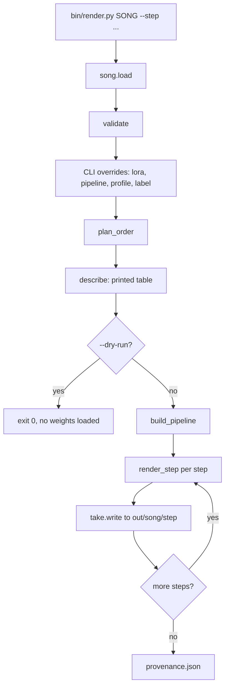
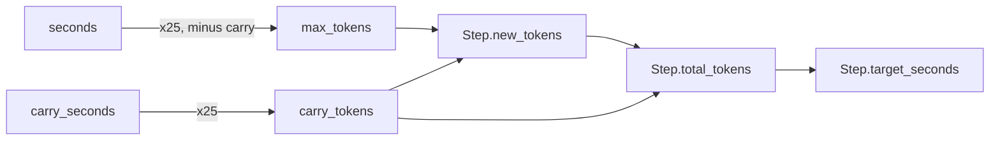
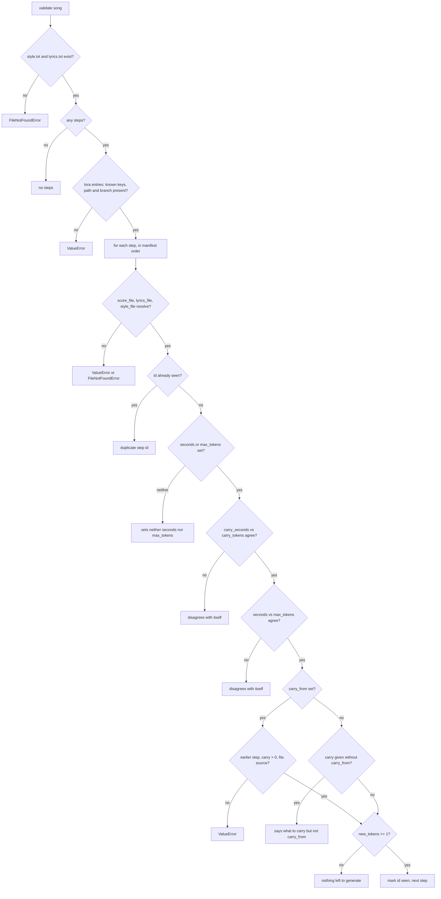
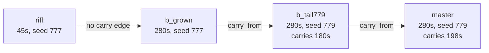
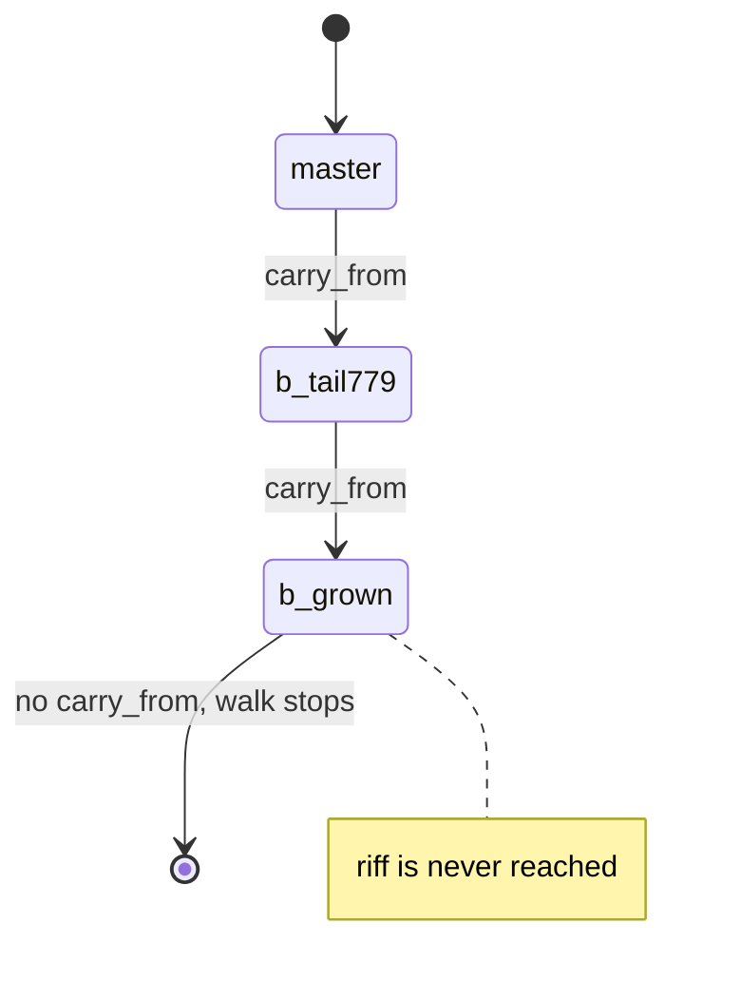
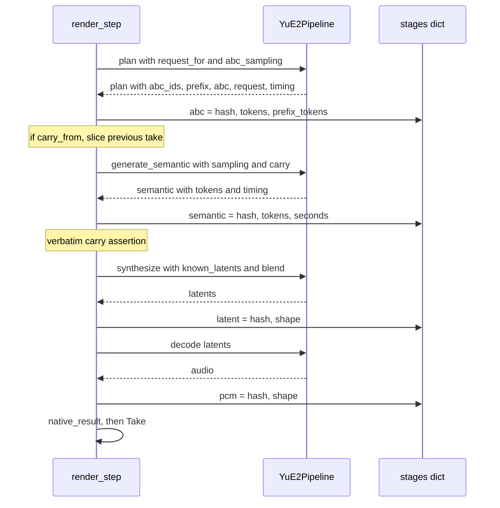
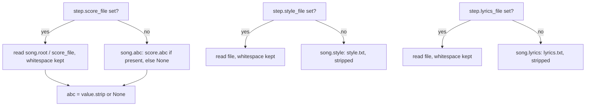
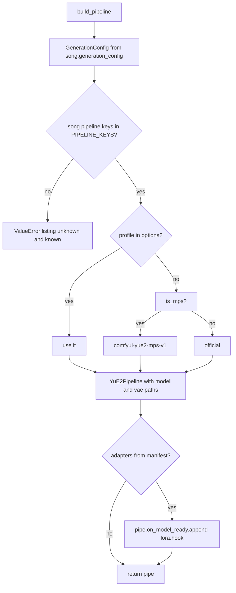
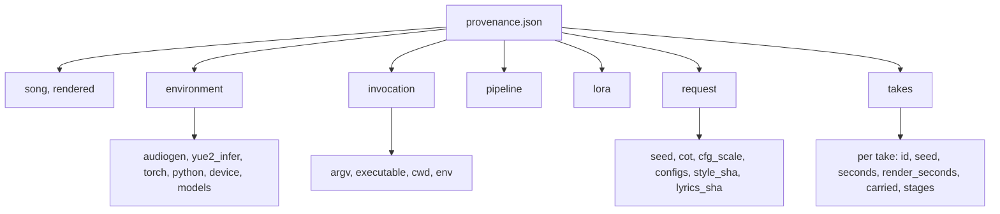

# How `audiogen-yue2` turns a song directory into audio

This document traces the whole path from a command line to a directory of FLAC
artifacts plus a `provenance.json` receipt. Every claim below is cited against
the source; line numbers are repo-relative to `audiogen-yue2`.

---

## 1. Overview

A song is a **directory**, and `song.json` is its **contract**
(`src/audiogen/song.py:1`). The directory holds the text that defines the song —
`style.txt`, `lyrics.txt`, optionally `score.abc`, plus any per-step override
files — and the manifest describes how many takes to render and how they chain
together.

Audio never lands in the repo. `bin/render.py:73` defaults `--out` to
`<repo>/out`, and the module docstring states the rule plainly
(`bin/render.py:9`): *the repo holds what defines a song; the studio holds what
it renders to.*



The ordering is deliberate: `song_module.load` is called at `bin/render.py:94`
with the comment *"validates before anything expensive happens"*, and the
`--dry-run` exit at `bin/render.py:119` sits **before** `build_pipeline` at
`bin/render.py:125`. Adapter construction (`bin/render.py:113`) also happens on
the dry-run side of that line, so a missing or mislabelled LoRA fails in
milliseconds rather than after the weights are resident
(`bin/render.py:109-111`).

---

## 2. The manifest contract

### Song level

Read in `song.load` (`src/audiogen/song.py:155-160`) into the `Song` dataclass
(`src/audiogen/song.py:91`):

| Key | Meaning |
| --- | --- |
| `id` | Song name; defaults to the directory name |
| `seed` | Default seed inherited by every step that does not set its own |
| `cot` | Chain-of-thought mode, default `"full"` |
| `cfg_scale` | Guidance scale, passed straight into the request |
| `generation_config` | Kwargs for the engine's `GenerationConfig` |
| `abc_sampling` | Sampling knobs for the score/plan stage |
| `semantic_sampling` | Sampling knobs for semantic token generation |
| `lora` | List of `{path, branch, strength}` adapter entries |
| `pipeline` | Engine *construction* options, allowlisted by `PIPELINE_KEYS` |
| `steps` | The takes, in order |

`label` is **not** a manifest key. It is set from `--label` only
(`src/audiogen/song.py:103-105`), because *"a step number belongs to the
experiment, not to the song."*

One legacy key is actively rejected: `pcm_bits` must be exactly the integer `24`
if present at all, otherwise `load` raises — the wrapper uses the engine's
native 24-bit FLAC writer (`src/audiogen/song.py:131-132`).

### Step level

The allowed keys are the `known` set at `src/audiogen/song.py:134-136`, and the
`Step` dataclass is `src/audiogen/song.py:46-61`: `id`, `seed`, `seconds`,
`max_tokens`, `carry_from`, `carry_seconds`, `carry_tokens`, `blend_seconds`,
`chunk_seconds`, `overlap_seconds`, `score_file`, `lyrics_file`, `style_file`.

Anything else is a **hard error**, not a warning
(`src/audiogen/song.py:140-143`): *"A typo in a manifest key would otherwise be
silently ignored and the step would render with a default nobody asked for."*

### Seconds versus tokens: convenience with an escape hatch

`TOKENS_PER_SECOND = 25` (`src/audiogen/song.py:39`), and
`seconds_to_tokens` is a plain `round(seconds * 25)`
(`src/audiogen/song.py:42-43`).

The design rule is stated in the module docstring
(`src/audiogen/song.py:23-33`): *"Seconds are a convenience over what the engine
actually takes, and a convenience that cannot be bypassed is a cage."* So each
derived quantity has a paired engine-unit key:



Both forms may be given for one quantity — a manifest is allowed to spell out
what it means — **but they must agree**. A mismatch raises an error naming both
values, and there is deliberately **no precedence rule**, *"because a precedence
rule is only discovered once the two have already drifted apart"*
(`src/audiogen/song.py:30-33`, enforced at `src/audiogen/song.py:206-218`).

Note the field-name asymmetry: the manifest key is `carry_tokens`, but the
dataclass field is `carry_token_count` (`src/audiogen/song.py:54`), because
`carry_tokens` is taken by the derived property. `load` maps one to the other at
`src/audiogen/song.py:148`.

The exact arithmetic:

- `Step.carry_tokens` (`src/audiogen/song.py:62-66`) — returns
  `carry_token_count` when set, else `seconds_to_tokens(carry_seconds or 0.0)`.
  A step with no carry at all is therefore `0`.
- `Step.new_tokens` (`src/audiogen/song.py:69-79`) — the budget for **new**
  tokens, which is what the engine's `max_tokens` means. If `max_tokens` is set
  it passes through untouched: *"that is the engine's own unit and its own
  meaning."* Otherwise it is `seconds_to_tokens(seconds) - carry_tokens`.
- `Step.total_tokens` (`src/audiogen/song.py:81-84`) — `new_tokens +
  carry_tokens`, i.e. what the take should end up as however it was specified.
- `Step.target_seconds` (`src/audiogen/song.py:86-88`) —
  `round(total_tokens / 25, 2)`.

**`seconds` means TOTAL length, including carried audio.** The carry is
subtracted inside `new_tokens` precisely so that a manifest can state the length
the take should end up at, *"which is the thing a person means"*
(`src/audiogen/song.py:73-75`).

Worked example, `b_tail779` from `burn_it_down`: `seconds: 280.0`,
`carry_seconds: 180.0`. So `carry_tokens = 4500`, `new_tokens = 7000 - 4500 =
2500`, `total_tokens = 7000`, `target_seconds = 280.0`. The engine is asked for
2500 new tokens, not 7000.

`carry_seconds` is never implicit. The docstring rejects a sentinel meaning "all
of it" because it *"reads fine until the take length changes underneath it"*
(`src/audiogen/song.py:19-21`), and `validate` turns that into a rule: a step
with `carry_from` and nothing kept is an error
(`src/audiogen/song.py:225-227`).

---

## 3. Validation

`validate` (`src/audiogen/song.py:172`) has one job, stated in its docstring:
*"Fail on a manifest that cannot render, before any weights are loaded."* It is
called from the bottom of `load` (`src/audiogen/song.py:161`) and again from
`bin/render.py:101` after CLI LoRA overrides mutate `song.lora`, so the
overridden song is re-checked rather than trusted.



Details worth having in prose rather than in the diagram:

- **Required files** (`src/audiogen/song.py:174-176`) — only `style.txt` and
  `lyrics.txt` are mandatory. `score.abc` is optional; `Song.abc` returns `None`
  when it is absent (`src/audiogen/song.py:117-119`).
- **Per-step file refs** (`src/audiogen/song.py:190-196`) — must be a non-empty
  string and must resolve to an existing file under the song root.
- **Ordering** (`src/audiogen/song.py:220-223`) — `carry_from` is checked
  against `seen`, the set of ids validated *so far*. A forward reference is
  therefore rejected with "which is not an earlier step", and so is a
  self-reference, because `seen.add(step.id)` happens last
  (`src/audiogen/song.py:237`).
- **Carry size** (`src/audiogen/song.py:228-230`) — you cannot keep more tokens
  than the source step's `total_tokens`. This is a static check against the
  manifest; `render_step` repeats it at runtime against the tokens actually
  produced (`src/audiogen/render.py:165-167`).
- **Ordering of the two self-disagreement checks** matters: carry is checked
  first *"the length check derives from it"* (`src/audiogen/song.py:204-205`),
  since the `seconds` vs `max_tokens` check subtracts `step.carry_tokens`.

Unknown *step* keys are rejected earlier, in `load`
(`src/audiogen/song.py:139-143`), not in `validate`. Unknown *pipeline* keys are
rejected later still, in `build_pipeline` (`src/audiogen/render.py:61-63`).

---

## 4. Step ordering and carry chains

`plan_order` (`bin/render.py:26-36`) answers: which steps must run?

- No `--step`: every step, in manifest order (`bin/render.py:28-29`).
- With `--step`: start at the target, follow `carry_from` backwards appending as
  it goes, stop when a step has no `carry_from`, then `reversed()` the list so it
  renders front to back (`bin/render.py:30-36`).

Because the walk is *backwards along dependencies only*, steps that nothing in
the chain carries from are simply never visited.

The real `burn_it_down` manifest
(`album/Forgives At Five/generation/burn_it_down/song.json`) is a four-step
chain:



Note the dashed edge: `b_grown` does **not** set `carry_from`. `riff` is a
45-second sketch that stands alone in the manifest; `b_grown` regenerates from
scratch at the same seed 777 for the full 280 seconds. The only real carry edges
are `b_grown → b_tail779` (180 s = 4500 tokens) and `b_tail779 → master`
(198 s = 4950 tokens), both with `blend_seconds: 0.5`.

Consequently:



`bin/render.py burn_it_down --step master` renders
`b_grown → b_tail779 → master` and **skips `riff` entirely**, because nothing in
the chain carries from it. `bin/render.py burn_it_down` with no `--step` renders
all four, `riff` included.

`cheap_arcade` is the degenerate case: a single step `master`, 280 s, seed 777,
no `carry_from`. `plan_order` returns a one-element list either way.

### `describe`

`describe` (`bin/render.py:39-48`) prints the resolved plan before anything
loads. It prints the carry in **seconds** — `step.carry_tokens / 25` — whatever
unit the manifest used, *"so a manifest using the engine's token units is still
legible next to one using seconds"* (`bin/render.py:44-45`). The columns are
step id, seed, `target_seconds`, carried seconds, `new_tokens`, and
`carry_from`.

---

## 5. The four stages

The module docstring of `src/audiogen/render.py:1-8` explains why the stages are
walked by hand at all: the library's `__call__` runs plan → semantic →
synthesize → decode in one go, *"which is the right shape for a single take and
the wrong one for a chain: a continuation has to hand the previous take's
semantic tokens to generation and its latents to synthesis. So the stages are
walked here instead, and every boundary is hashed on the way past."*



Stage by stage (`src/audiogen/render.py:149-204`):

1. **plan** — `pipe.plan(request=request_for(song, step), abc_sampling=song.abc_sampling or None)`
   (`src/audiogen/render.py:155`). Records
   `stages["abc"] = {hash, tokens, prefix_tokens}` from `plan.abc_ids` and
   `plan.prefix` (`src/audiogen/render.py:156-157`). Note `or None`: an empty
   `abc_sampling` dict is passed as `None`, letting the engine use its own
   defaults rather than an empty override.

2. **carry setup** (`src/audiogen/render.py:159-172`) — only when
   `step.carry_from` is set. It requires that `previous` is exactly the named
   step (`src/audiogen/render.py:161-163`), and that the previous take actually
   produced at least `carry_tokens` semantic tokens
   (`src/audiogen/render.py:164-167`) — the runtime counterpart to the manifest
   check in `validate`. Then:
   - `carry_tokens = list(previous.semantic[:keep])` — the semantic prefix fed
     into generation;
   - `known_latents = previous.latents[:keep]` — the latent prefix fed into
     synthesis;
   - `carried` records `from`, `seconds`, `tokens`, `semantic_hash`,
     `latent_hash`.

3. **generate_semantic** — `sampling = {**song.semantic_sampling, "max_tokens": step.new_tokens}`
   (`src/audiogen/render.py:174`). This is the key injection point: everything in
   `semantic_sampling` comes from the **song** — temperature, top_p, top_k,
   repetition_penalty, min_tokens — while `max_tokens` is overwritten per-step
   with `step.new_tokens`. A song-level `max_tokens` in the manifest is therefore
   always superseded. Records `stages["semantic"] = {hash, tokens, seconds}`.

4. **verbatim-carry check** (`src/audiogen/render.py:180-184`) — when a carry was
   supplied, the first `len(carry_tokens)` tokens of the returned stream must be
   *bit-identical* to what was handed in, or it raises

   ```
   AssertionError: step 'master': carried tokens were not reproduced verbatim;
   the continuation did not take
   ```

   This is the check that makes a carry chain meaningful: if the engine ignored
   the prefix, the "continuation" would silently be a fresh take that merely
   claims lineage.

5. **synthesize** — `pipe.synthesize(semantic, known_latents=known_latents, blend_seconds=..., chunk_seconds=..., overlap_seconds=...)`
   (`src/audiogen/render.py:186-189`). The three `*_seconds` knobs are per-step
   fields, all defaulting to `0.0`. Records
   `stages["latent"] = {hash, shape}`.

6. **decode** — `pipe.decode(latents)` (`src/audiogen/render.py:192`), recording
   `stages["pcm"] = {hash, shape}` at `SAMPLE_RATE = 48000`
   (`src/audiogen/render.py:22`).

Finally `native_result` (`src/audiogen/render.py:198`) and the `Take`
(`src/audiogen/render.py:200-204`). `Take.seconds` is derived from the semantic
token count, not from the audio array: `round(len(semantic.tokens) / 25, 2)`.

The hashes themselves come from `src/audiogen/hashes.py`: token streams are
normalised to `int64` so a list and an `int32` array of the same tokens agree
(`src/audiogen/hashes.py:24-25`); float arrays fold `dtype` and `shape` into the
digest, *"because an array that reshaped or changed precision is a different
artifact even if the bytes line up"* (`src/audiogen/hashes.py:8-10`,
`src/audiogen/hashes.py:28-30`); and all of them are truncated to 16 hex
characters because that is *"enough to compare by eye in a terminal and in a
commit message, which is where these actually get read"*
(`src/audiogen/hashes.py:10-11`). The render loop prints exactly that line per
step (`bin/render.py:133-134`).

### `native_result`

`pipe.generate()` builds the engine's `SongResult` on its way past; driving the
stages by hand skips it, so `native_result` rebuilds it from the same pieces
(`src/audiogen/render.py:83-106`). It calls `pipe.effective_config` with the
same per-step `max_tokens` override, then attaches an `audiogen` block naming the
step, the adapters, the carry note, and the writer.

The adapters go into the config for a specific reason
(`src/audiogen/render.py:88-91`): the engine's `weights` block pins the *base*
checkpoint, which is not what a LoRA take actually ran — *"without this, two
takes that differ only by an adapter carry the same request identity."*

---

## 6. Text resolution

`request_for` (`src/audiogen/render.py:134-146`) builds the engine's
`SongRequest`. Its inner `text_input(key, fallback)` is the whole rule:



Three per-step keys override three song-level files:

| Step key | Song-level fallback | Property |
| --- | --- | --- |
| `score_file` | `score.abc` | `Song.abc` (`src/audiogen/song.py:116-119`) |
| `lyrics_file` | `lyrics.txt` | `Song.lyrics` (`src/audiogen/song.py:112-114`) |
| `style_file` | `style.txt` | `Song.style` (`src/audiogen/song.py:108-110`) |

**Whitespace differs between the two paths.** The song-level properties call
`.strip()`; `text_input` returns `read_text()` untouched. The comment is
explicit (`src/audiogen/render.py:143`): *"Explicit style and lyric files retain
their whitespace."* The score is the one exception — whichever path it came
from, it is stripped and collapsed to `None` if empty
(`src/audiogen/render.py:140-141`), because the engine takes `abc=None` to mean
"no score".

`burn_it_down` is the real example. Its first three steps — `riff`, `b_grown`,
`b_tail779` — all set `lyrics_file: "lyrics-chain.txt"` and
`score_file: "score-chain.abc"`. The fourth step, `master`, sets **neither**, so
it falls back to the song-level `lyrics.txt` and `score.abc`. The step that
produces the keeper therefore runs on different lyrics and a different score
from the three steps feeding it, while carrying 198 seconds of their audio
verbatim. Note the whitespace consequence: `master`'s lyrics are stripped, the
chain steps' are not.

The rest of the request: `seed=step.seed` (per-step, defaulting to the song
seed at `src/audiogen/song.py:144`), `cot=song.cot`, `cfg_scale=song.cfg_scale`,
and `id=request_id(song, step)`.

`request_id` (`src/audiogen/render.py:113-131`) names the take after what shaped
it: `<song.id>.<step.id>` plus one `<adapter-stem>-x<strength>` part per
adapter, sanitised to filename-safe characters and truncated to 180. A
`--label` replaces the derived name entirely. The docstring notes the id *"never
reaches the prompt or the token stream, so an arm tag cannot confound a
comparison"* — but it does reach the listening page, which titles each case by
it, and *"two arms of an A/B that print the same title are not a comparison
anyone can read."*

---

## 7. Pipeline construction

`build_pipeline` (`src/audiogen/render.py:56-80`):



**`GenerationConfig`** is constructed by splatting `song.generation_config`
(`src/audiogen/render.py:60`), so an unknown key there fails as a `TypeError`
from the engine's own dataclass.

**`PIPELINE_KEYS`** (`src/audiogen/song.py:168-169`) is an allowlist:
`backend`, `quantization`, `memory_budget_gib`, `vae_core_frames`, `offload_ar`,
`device`, `profile`. The comment above it explains why it is kept apart from
`generation_config` (`src/audiogen/song.py:165-167`): these keys decide *how the
engine is constructed, as opposed to how it samples* — memory layout and tiling
— and *"a wrong key here would otherwise be swallowed as a sampling override
nobody asked for."* The check at `src/audiogen/render.py:61-63` raises listing
both the unknown keys and the known set.

The CLI feeds this allowlist through `pipeline_options` (`bin/render.py:51-55`),
which collects only the options explicitly supplied — `backend`, `device`,
`offload_ar`, `memory_budget_gib` — so an unset flag never overwrites the
manifest. They are merged manifest-first, CLI-second (`bin/render.py:102`), and
`--profile` is applied separately on top (`bin/render.py:103-104`).

**Profile default** (`src/audiogen/render.py:66-71`): an explicit `profile` wins
outright. Otherwise the device is inspected — `device == "mps"`, or `device ==
"auto"` with no CUDA and MPS available — and the profile becomes
`comfyui-yue2-mps-v1` on MPS and `official` everywhere else. These are the only
two values `--profile` accepts (`bin/render.py:87-88`).

**LoRA attaches through `pipe.on_model_ready`, not by patching `pipe._model`.**
The reason is stated at `src/audiogen/render.py:76-78`: *"the engine rebuilds and
moves that model between stages, so a patch applied once from outside is
silently dropped."* `src/audiogen/lora.py:3-7` spells out the full set of
reasons — the engine constructs the model lazily, sets it to `None` on
`close()`, moves it to CPU around decoding, prepares it for fp8 on the AR path
and restores it before NAR. `on_model_ready` fires on **every stage entry**, not
just construction, and tells the callback which stage is about to run.

That in turn forces the callback to be idempotent (`src/audiogen/lora.py:151-154`):
a naive additive apply would compound across firings, so the hook stashes each
touched tensor's base value on the model the first time and restores from that
base before every re-apply (`src/audiogen/lora.py:158-168`).

Branch classification is declared, never sniffed. `AR_MODULES` and `NAR_MODULES`
(`src/audiogen/lora.py:33-34`) drive `branch_of`, and the comment above them
records a real bug: `llm2vae` and `vae2llm` *"look shared by name but are not"* —
every use is on the NAR path — and treating them as "either" *"silently let a NAR
adapter apply during AR."* An unclassifiable module raises rather than guesses,
because *"applying a delta on the wrong stage is silent, and shows up only as a
take that sounds subtly off"* (`src/audiogen/lora.py:124-128`). The CLI's
`--lora PATH:BRANCH[:STRENGTH]` parser insists on the branch for the same reason
(`bin/render.py:63-65`): *"an adapter aimed at the wrong half of the model has to
be an error, not a guess."*

`Adapter.__post_init__` (`src/audiogen/lora.py:43-57`) reads the safetensors
header alone to check the declared branch actually appears in the file, *"so a
mislabelled adapter fails during --dry-run instead of 14 minutes later."*

---

## 8. Outputs and provenance

### `take.write`

`Take.write(directory)` (`src/audiogen/render.py:40-53`) makes the directory and
delegates to the engine's own writer: `self.result.save_artifacts(directory)`,
where `self.result` is the `SongResult` built by `native_result`. The layout is
the engine's native artifact layout — audio plus a `result.json` carrying an
`artifacts` block and a `request.json`.

Why the receipt is written here rather than reconstructed later is the most
load-bearing comment in the file (`src/audiogen/render.py:41-49`): the listening
page re-hashes every file it copies against the `artifacts` block in
`result.json` and **withholds the player when they disagree**. That check is only
worth something if the receipt was written by whatever produced the audio, so it
is written *"from the stage outputs still in memory, rather than reconstructed
later from the files on disk — which would only prove the files equal
themselves."*

The render loop calls it per step into `out/<song.id>/<step.id>`
(`bin/render.py:124`, `bin/render.py:130`), so every step of a chain leaves its
own directory, not just the final one.

### `provenance.json`

Written once after the loop from `bin/render.py:136-138`, into
`out/<song.id>/provenance.json`. Built by `provenance`
(`src/audiogen/render.py:245-284`) — *"What a run needs to be reproducible later,
resolved rather than referenced."*



- **`environment`** (`src/audiogen/render.py:253-261`) — `audiogen` is
  `wrapper_commit()`, `yue2_infer` is the installed distribution version, plus
  `torch.__version__`, the Python version, the resolved device, and the models
  path as a string.
- **`wrapper_commit`** (`src/audiogen/render.py:229-242`) — shells out to
  `git describe --always --dirty` against the package directory, returning
  `"unknown"` on any failure. The docstring says why it exists: *"provenance
  already pins the engine and torch. It said nothing about the code doing the
  pinning, which is the part most likely to have moved."* The `--dirty` suffix
  means an uncommitted wrapper is visible in the receipt.
- **`invocation`** (`src/audiogen/render.py:263-268`) — the literal `sys.argv`,
  `sys.executable`, the cwd, and the filtered environment.
- **`recorded_env`** (`src/audiogen/render.py:213-226`) — walks `os.environ` in
  sorted order and keeps only keys starting with `ENV_PREFIXES`
  (`src/audiogen/render.py:209`): `PYTORCH`, `TORCH`, `MPS`, `MTLFLASH`, `OMP`,
  `MKL`, `CUDA`, `HF_`. These are the *"variables that can change what gets
  rendered: threading, backend selection, device visibility, and which weights
  HF_HOME/HF_HUB_OFFLINE resolve to."* Any kept key whose name contains `TOKEN`,
  `KEY`, `SECRET`, `PASSWORD`, `AUTH` or `CREDENTIAL`
  (`src/audiogen/render.py:210`) has its value replaced by the literal string
  **`"<set, not recorded>"`**. The motivating case is named: *"HF_TOKEN sits
  squarely inside the HF_ prefix and is a live credential. A provenance file is
  copied into every output directory and travels with the audio, so the value
  must never land in one; that it was set is the part that matters for
  reproducing a run."*
- **`pipeline`** and **`lora`** (`src/audiogen/render.py:269-270`) — the
  effective pipeline dict after CLI merge, or `null` if empty; and one
  `Adapter.identity()` per adapter, each `{path, branch, strength, sha256_16}`
  (`src/audiogen/lora.py:59-63`), or `null`.
- **`request`** (`src/audiogen/render.py:271-277`) — `seed`, `cot`, `cfg_scale`,
  the three config dicts verbatim, and `style_sha` / `lyrics_sha`: 16-hex
  digests of the **song-level** `style.txt` and `lyrics.txt` as UTF-8. Note the
  consequence — these are the stripped song-level texts, so a step that
  overrode them via `lyrics_file` is not reflected here; its actual text is
  pinned in that step's own `result.json` request identity instead.
- **`takes`** (`src/audiogen/render.py:278-283`) — one entry per rendered take:
  `id`, the step's `seed` looked back up from the song, `seconds`,
  `render_seconds`, `carried` (or `null`), and the full four-entry `stages`
  dict. For a `burn_it_down` chain that is four entries, each carrying the
  `abc` / `semantic` / `latent` / `pcm` hashes that let any later run be
  compared boundary by boundary rather than only at the audio.
